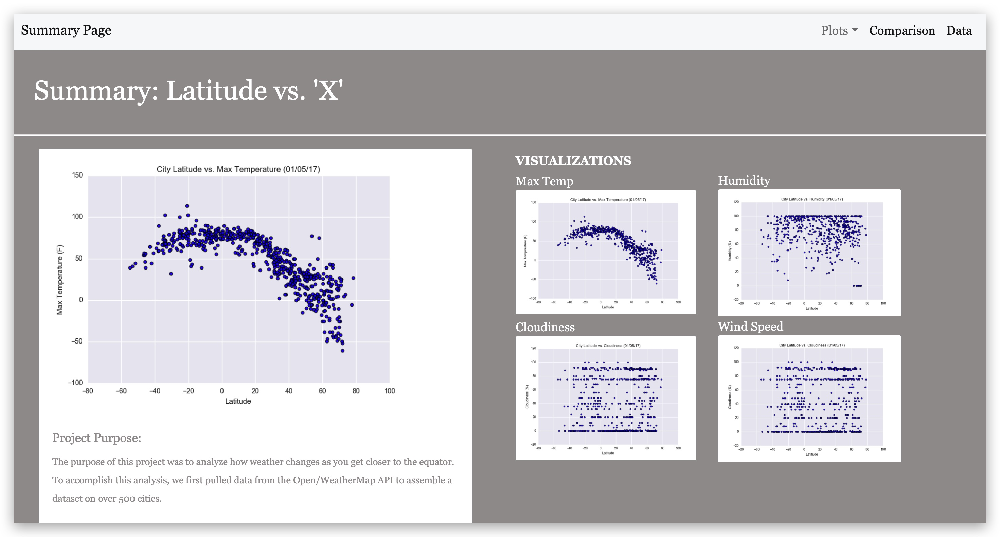
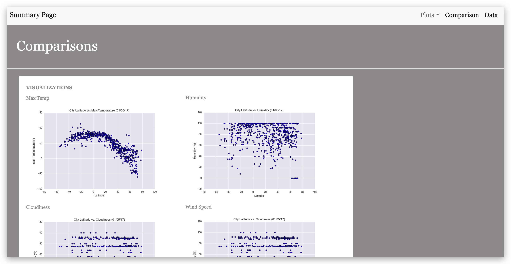
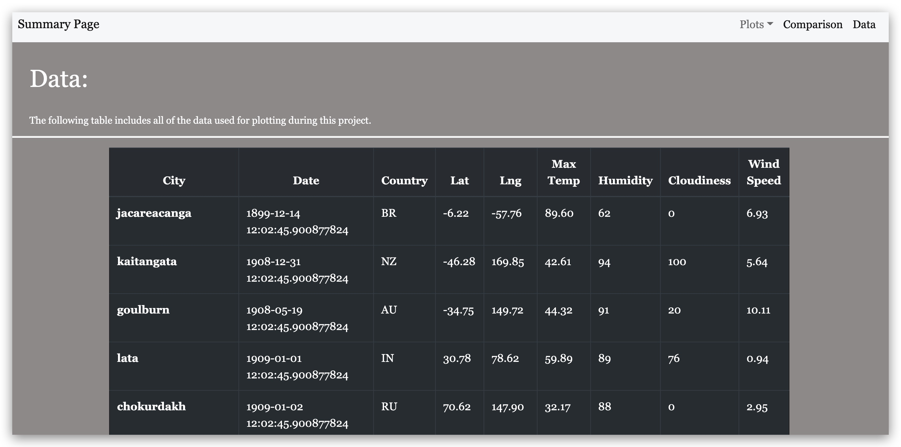
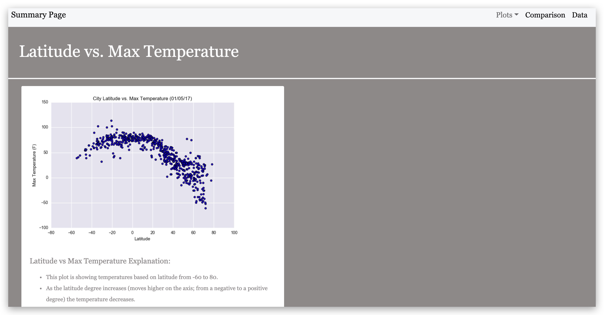
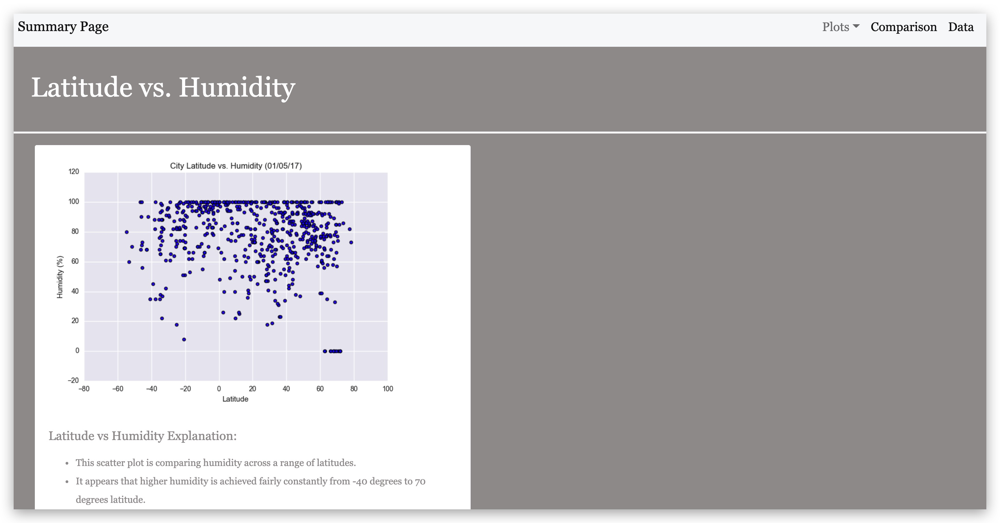
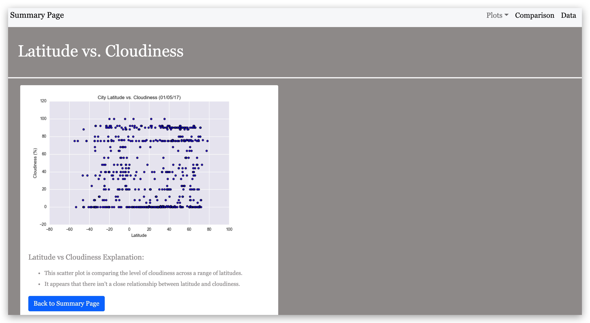
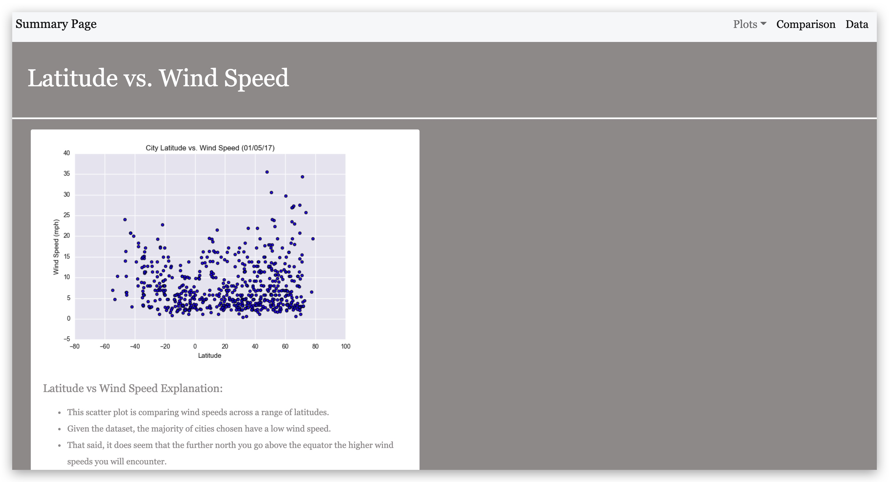
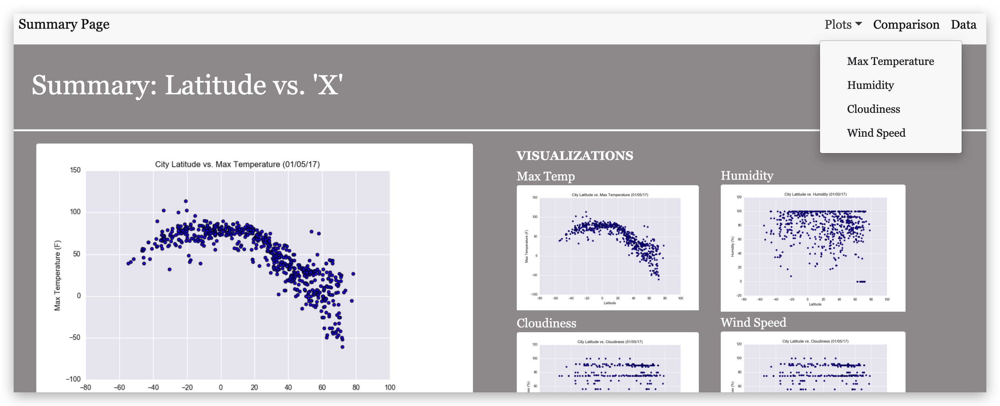

# Latitude Analysis Dashboard using HTML, CSS, and Bootstrap

For this project I created a visualization dashboard website using visualizations from a previous project that looked at the effect of proximity to the equator on the specific weather statistics: Max Temp, Humidity, Cloudiness & Wind Speed. 

My visualization dashboard includes the following (images of each page of the dashboard can be found at the end of this README file):
* A [Summary page](#summary-page) containing:
  * An explanation of the weather project.
  * Links to each visualization's page. I also included a sidebar containing preview images of each plot.
      * Clicking any of the images will take you to that specific visualization's page.
* Four [visualization pages](#visualization-pages), each with:
  * The visualization of the selected comparison.
  * A brief description of the plot and its significance.
* A ["Comparisons" page](#comparisons-page) that:
  * Contains all of the visualizations on the same page for easy visual comparison.
  * Used Bootstrap to showcase all four of the visualizations.

* A ["Data" page](#data-page) that:
  * Displayed a bootstrap, responsive table containing the data used in the weather project.

    * I used pandas to read in the `.csv` of my original project data. Then I read it to a HTML file so I could then import that into my overall site.

This website can be reached at: [Weather Project Visualization Dashboard](https://jforbis.github.io/web-design-challenge/) 
  * This site is being deployed through GitHub and the direct url is 'https://jforbis.github.io/web-design-challenge/'

***

## Screenshots

This section contains screenshots of each page of my site. 

#### _Summary page_

#### _Comparisons page_

#### _Data page_

***

## Visualization pages

_Max Temp_

_Humidity_

_Cloudiness_

_Wind Speed_

#### _Navigation menu_

